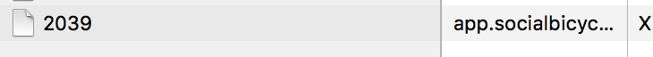

# MMM-socialbicycles
<B>Station monitor</B> for the <B>socialbicycles (e.g. Wavelo in Kraków, Poland)</B> bike-sharing network.

This module is an extension of the amazing [MagicMirror2](https://github.com/MichMich/MagicMirror) project by [MichMich](https://github.com/MichMich/) which has inspired me to share my coding skills with others as well. Check it out, you know you want to :). 

This module is based on [MMM-nextbike](https://github.com/yo-less/MMM-nextbike) by [yo-less](https://github.com/yo-less/). Thanks for the great work!

## Current version

v1.0.0

## Languages
As of version 1.0.0, MMM-nextbike features language support for `German (de)` and `English (en)` mirrors.

## Prerequisite
A working installation of [MagicMirror2](https://github.com/MichMich/MagicMirror)
 
## Dependencies
  * npm
  * [request](https://www.npmjs.com/package/request)
  * [xml2js](https://www.npmjs.com/package/xml2js)

## Installation
1. Navigate into your MagicMirror's `modules` folder.
2. Execute `git clone https://github.com/0lek/MMM-socialbicycles.git`.
3. Execute `cd MMM-socialbicycles`.
3. Execute `npm install`.

## Module behavior
Please note that this module auto-creates a module header which displays the name of the chosen nextbike station.  
It is therefore recommended not to add a 'header' entry to your config.js for this module.

This module automatically disappears from your mirror as soon as a station has run out of bikes. It reappears shortly after the first bike has been returned to your chosen station.

This module has been programmed to allow for multiple instances. Simply add more MMM-socialbicycles config entries to your config.js file to display multiple stations and configure them according to your needs.

## Configuration
Sample minimum configuration entry for your `~/MagicMirror/config/config.js`:

    ...
    
    {
        module: 'MMM-socialbicycles',
        position: 'top_left',
        config: {
            stationID: '', 		// Your station ID
        }
    } 							// If this isn't your last module, add a comma after the bracket
    
    ...

## Figuring out the correct cityID and stationID

That's a little bit complicated, but not too much. What I did - example based on Wavelo, but should be same for other
systems that use Socialbicycles infrastructure.

1. Go to en.wavelo.pl
2. Click on map
3. Right click on the map and select "Inspect Element" (for Safari)
4. Select the right-last tab, "Network"
5. Now click on the station in the map that you're interested in and observe the element inspector.
You'll be looking for a new row with a digit-only name and the domain *app.socialbicycles.com*.

6. Bingo! The number in the name column is the ID you want. You can right-click on the item and select "Open in New Tab". You'll get a JSON with all the data that's available. You can double-check there.
7. Enter the ID into the config.js file. That's it!

## Licence
MIT License

Copyright (c) 2016 yo-less / Jens

Permission is hereby granted, free of charge, to any person obtaining a copy
of this software and associated documentation files (the "Software"), to deal
in the Software without restriction, including without limitation the rights
to use, copy, modify, merge, publish, distribute, sublicense, and/or sell
copies of the Software, and to permit persons to whom the Software is
furnished to do so, subject to the following conditions:

The above copyright notice and this permission notice shall be included in all
copies or substantial portions of the Software.

THE SOFTWARE IS PROVIDED "AS IS", WITHOUT WARRANTY OF ANY KIND, EXPRESS OR
IMPLIED, INCLUDING BUT NOT LIMITED TO THE WARRANTIES OF MERCHANTABILITY,
FITNESS FOR A PARTICULAR PURPOSE AND NONINFRINGEMENT. IN NO EVENT SHALL THE
AUTHORS OR COPYRIGHT HOLDERS BE LIABLE FOR ANY CLAIM, DAMAGES OR OTHER
LIABILITY, WHETHER IN AN ACTION OF CONTRACT, TORT OR OTHERWISE, ARISING FROM,
OUT OF OR IN CONNECTION WITH THE SOFTWARE OR THE USE OR OTHER DEALINGS IN THE
SOFTWARE.
